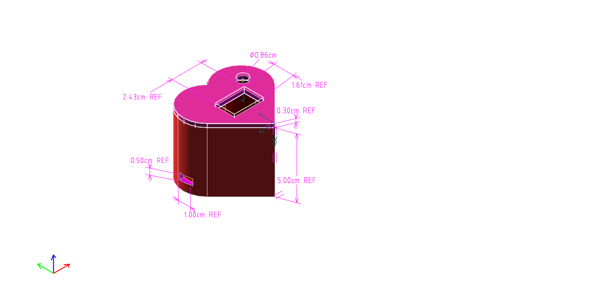
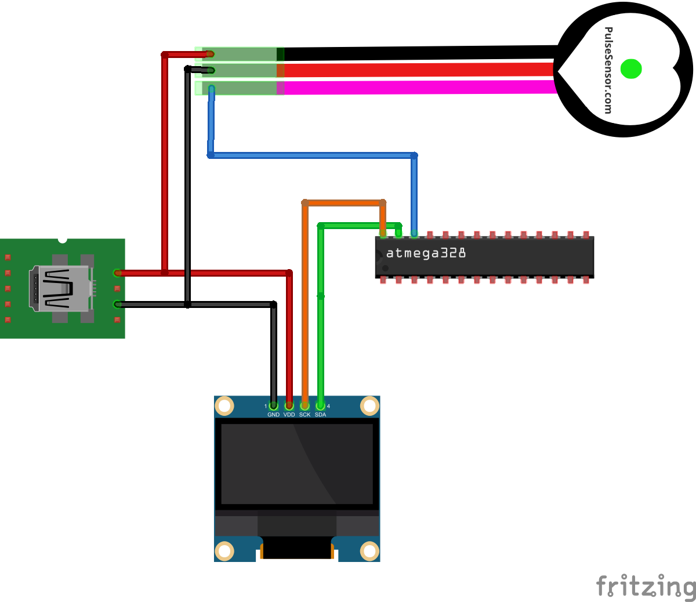
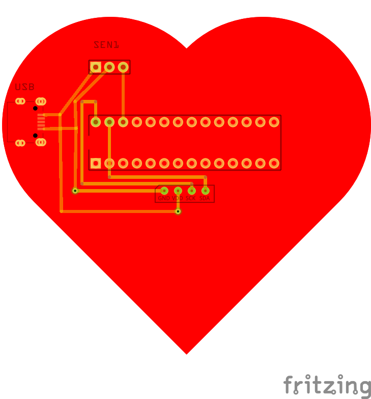

## Project description

Main goal of this project to make cats happy. Dogs can be made happy too.
Done with love.

## Team (authors)
* John Smith
* John Carmack
* Samuel Johnson

[Project at Thingverse](https://www.thingiverse.com/thing:44579)

[Youtube video](https://www.youtube.com/watch?v=dQw4w9WgXcQ)

## Parts list

| Amount |	Part |
|--------|-------|
|	1	|	OLED 128x64 I2C Monochrome Display |
|	1	|	Pulse Sensor |
|	1	|	atmega328 |
|	1	|	Mini-USB _B_ connector with 5th pin broken out.	package usb-micro_b |
